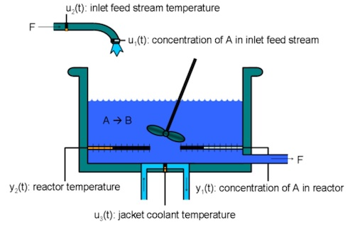

# Continuous-stirred Tank Reactor (CSTR) python simulator

[Project Bonsai](https://aka.ms/bonsai) code sample demonstrating
chemical process optimization in a continuously-stirred tank reactor
(CSTR). Efficient control of an exothermic, non-linear chemical reaction
with CSTR is a benchmark in which to compare PID, MPC and Bonsai brains.

The chemical process here considers a transition from low to high
conversion rate (high to low residual concentration) in a single first-order exothermic and irreversible chemical reaction A -> B, with the follow assumptions:

* Perfectly mixed vessel
* The inlet stream of reagent A enters the tank at a constant volumetric rate
* The product stream B exits continuously at the same volumetric rate
* Liquid density is constant
* The volume of reacting liquid is constant


Because the chemical reaction is exothermic (produces heat), the reactor temperature
must be controlled to prevent a thermal runaway. The control task is
complicated by the fact that the process dynamics are nonlinear and
transition from stable to unstable and back to stable as the conversion
rate increases. The reactor dynamics are modeled in Simulink. The
controlled variables (states) are the residual concentration  and the
reactor temperature , and the manipulated variable (action) is the
temperature of the coolant circulating in the reactor's cooling jacket.




This example shows how to use Project Bonsai's Machine Teaching
strategies to learn a controller for a chemical reactor transitioning
from low to high conversion rate. For background, see Seborg, D.E. et
al., "Process Dynamics and Control", 2nd Ed., 2004, Wiley, pp. 34-36.
This sample is largely adapted from the MathWorks':
[Gain scheduled control of a chemical reactor](https://www.mathworks.com/help/control/ug/gain-scheduled-control-of-a-chemical-reactor.html).

## Prerequisites

* Docker
* Python >= 3.7.4
* Pandas
* Scipy
* python-dotenv
* matplotlib

## Getting Set Up

This section will show the steps to use the CSTR Python simulator in the Bonsai Platform.

### 1.Build the Docker container with the Dockerfile

```shell
docker build -t cstr_sim -f Dockerfile ./
```

Now you have two ways to run it via Bonsai Platform. 

### 2. Import your simulator to Bonsai or Run it locally

#### Import simulator

Login to your ACR account 

```shell
docker login <Registry>.azurecr.io
```

Tag your image

```shell
docker tag cstr_sim <Registry>.azurecr.io/cstr_sim:v1
```

Push to your ACR

```shell
docker push <Registry>.azurecr.io/cstr_sim:v1
```

Import the simulator in Bonsai Platform

Click on add new sim


Choose 'other sim'


Import from your ACR to Bonsai Env and click on 'Create simulator'


After this will just need to create a new brain, use the inkling file cstr_brain.ink to start training your new brain.


#### Run locally

In you machine run the Docker image pointed to your Bonsai workspace with the command below.

```shell
docker run --rm -it -e SIM_ACCESS_KEY=<Bonsai Access Key> -e SIM_API_HOST="https://api.bons.ai" -e SIM_WORKSPACE=<Bonsai Workspace ID> cstr_sim
```

After this, your simulator will appear in the simulator tab in the Bonsai Platform and you just have to create a new brain, use the inkling file cstr_brain.ink to start training your new brain.

## Actions (Manipulated Variables)

Bare minimum for the sim (all units are continuous):

| Action | Range      | Units    |
|--------|------------|----------|
| dTc    | [-10, 10]  | [Kelvin] |

Final set for **Bonsai training**:

- Performance improved when making the brain learn the per-timestep adjustment to apply to previous dTc.
- Thus, we maintained control to be dTc_adjust, and added an accumulator on sim side.

| Action     | Continuous Value | Units        |
| --------   | ------------     | ----------   |
| dTc_adjust | [-5, 5]*         | [Kelvin/min] |

*Note, given an additional rule that requires keeping dTc changes at no
more than 10 Kelvins/min, we forced dTc_adjust to be on the [-5, 5]
range (for Ts=0.5min)

## States (Control Variables)

Which matches the set of Observable States used for **bonsai training**

| State | Continuous Value | Units     |
| ----- | ---------------- | -----     |
| Cr    | [0.1, 12]        | [kmol/m3] |
| Tr    | [10, 800]        | [Kelvin]  |
| Tc    | [10, 800]        | [Kelvin]  |
| Cref  | [2, 8.57]        | [kmol/m3] |
| Tref  | [311.2, 373.1]   | [Kelvin] |

> Note, .ink file defines ranges higher than the ones shown here. That
> is made in purpose since the brain will try to explore, and thus will
> hit extreme limits in doing so.

`Tref` was removed as observable state since brain to simplify brain's
training. With Bonsai's solution we don't need `Tref` to be able to drive
the concentration linearly from one point to the next.


## Constraints

* `Tc < 10` degrees / min
* `Tr < 400` to prevent thermal runaway

## Model Overview and Instructions

Please open the Python script, `sim\cstr_model.py`,
for further information about the process model and its dynamics.

# Project

> This repo has been populated by an initial template to help get you started. Please
> make sure to update the content to build a great experience for community-building.


## Contributing

This project welcomes contributions and suggestions.  Most contributions require you to agree to a
Contributor License Agreement (CLA) declaring that you have the right to, and actually do, grant us
the rights to use your contribution. For details, visit https://cla.opensource.microsoft.com.

When you submit a pull request, a CLA bot will automatically determine whether you need to provide
a CLA and decorate the PR appropriately (e.g., status check, comment). Simply follow the instructions
provided by the bot. You will only need to do this once across all repos using our CLA.

This project has adopted the [Microsoft Open Source Code of Conduct](https://opensource.microsoft.com/codeofconduct/).
For more information see the [Code of Conduct FAQ](https://opensource.microsoft.com/codeofconduct/faq/) or
contact [opencode@microsoft.com](mailto:opencode@microsoft.com) with any additional questions or comments.

## Trademarks

This project may contain trademarks or logos for projects, products, or services. Authorized use of Microsoft 
trademarks or logos is subject to and must follow 
[Microsoft's Trademark & Brand Guidelines](https://www.microsoft.com/en-us/legal/intellectualproperty/trademarks/usage/general).
Use of Microsoft trademarks or logos in modified versions of this project must not cause confusion or imply Microsoft sponsorship.
Any use of third-party trademarks or logos are subject to those third-party's policies.
