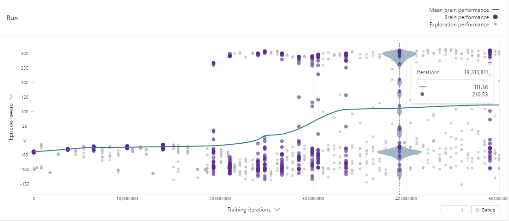

# Bipedal Walker with Stump Track

## Objective

Demonstrate usage of curriculum learning with manual lessons for the challenging task of learning to gait over stump obstacles with randomized height and spacing. Curriculum learning is a Machine Teaching strategy where the agent is gradually introduced to more and more challenging scenarios.


Often times on problems with highly random simulator configuration variables, learning can struggle to improve. With curriculum learning, the agent in this sample first learns to walk and then the next lesson introduces obstacles. Initially the reward should increase and when the lesson transitions, it is expected for the reward decrease since it is now faced with harder episodes. The reward should increase as training progresses to a higher value than without using the staged learning approach.

[Curriculum Docs](https://docs.microsoft.com/en-us/bonsai/inkling/keywords/curriculum)

### Curriculum Learning (multi_lesson.ink)


```javascript
            lesson easy_course {
                scenario {
                    stump_height: 0,
                    obstacle_spacing: 0,
                }
                training {
                    LessonRewardThreshold: 230,
                }
            }

            lesson hard_course {
                scenario {
                    stump_height: number<0 .. 3>,
                    obstacle_spacing: number<0 .. 6>,
                }
                training {
                    LessonRewardThreshold: 230,
                }
            }
```

### No Curriculum Learning (gait.ink)



```javascript            
            lesson hard_course {
                scenario {
                    stump_height: number<0 .. 3>,
                    obstacle_spacing: number<0 .. 6>,
                }
            }

```

## Configuration Parameters

| SimConfig    | Range                                             |
| ---------| ------------------------------------------------------- |
| stump_height | [0, 3] |
| obstacle_spacing |  [0, 6] |
| poly_shape[12] |  array of length 12 with range of [0, 4] *not used for stump track* |

## Array Action

| Action | Continuous Value | Array Elements |
| ------ | ---------------- | ------- |
| leg_1_torque[2] | [-1, 1] | [hip joint, knee joint] |
| leg_2_torque[2] | [-1, 1] | [hip joint, knee joint] |

## States

Num   | Observation              |  Min   |   Max  | Mean
------|--------------------------|--------|--------|------
0     | hull_ang                 |  0     |  2*pi  |  0.5
1     | hull_ang_vel             |  -inf  |  +inf  |  -
2     | x_velocity               |  -1    |  +1    |  -
3     | y_velocity               |  -1    |  +1    |  -
4     | leg_1_hip_angle          |  -inf  |  +inf  |  -
5     | leg_1_hip_speed          |  -inf  |  +inf  |  -
6     | leg_1_knee_angle         |  -inf  |  +inf  |  -
7     | leg_1_knee_speed         |  -inf  |  +inf  |  -
8     | leg_1_contact            |  0     |  1     |  -
9     | leg_2_hip_angle          |  -inf  |  +inf  |  -
10    | leg_2_hip_speed          |  -inf  |  +inf  |  -
11    | leg_2_knee_angle         |  -inf  |  +inf  |  -
12    | leg_2_knee_speed         |  -inf  |  +inf  |  -
13    | leg_2_contact            |  0     |  1     |  -
14-23 | 10 lidar readings        |  -inf  |  +inf  |  -

## Terminal Conditions

- Episode length greater than 2000
- Hull collides with ground or obstacle


## Install Requirements

1. Download **either** [miniconda](https://conda.io/miniconda.html) or [Anaconda](https://www.anaconda.com/download/)
2. Open Anaconda / miniconda command prompt
3. Change directory to the parent directory
    ```cmd
    cd samples/gym-bipedal-walker-sample
    pip install -r requirements.txt
    ```

## Running the Simulator Locally

Run the simulator locally by the following command and setting environment variables for SIM_WORKSPACE and SIM_ACCESS_KEY.

```bash
python bipedal_walker.py
```

and then attach to your brain:

```bash
bonsai simulator unmanaged connect \                          
    -b <brain_name> \
    -a Train \
    -c <concept_name> \
    --simulator-name BipedalWalkerSim
```

Optionally, run the simulator without visualization:

```bash
python bipedal_walker.py --headless
```

## Building Simulator Packages

Using the [azure-cli](https://pypi.org/project/azure-cli), you can build the provided dockerfile to create a simulator package:

```bash
az acr build --image <IMAGE_NAME>:<IMAGE_VERSION> --file Dockerfile --registry <ACR_REGISTRY> .
```

## Useful Resources

- [Bonsai Docs](https://docs.microsoft.com/en-us/bonsai/)

## Acknowledgements

The sample has been inspired and adapted from [teachDeepRL](https://github.com/flowersteam/teachDeepRL)

Paper: R. Portelas, C. Colas, K. Hofmann, and P.-Y. Oudeyer. Teacher Algorithms For Curriculum Learning of Deep RL in Continuously Parameterized Environments. CoRL 2019. https://arxiv.org/abs/1910.07224